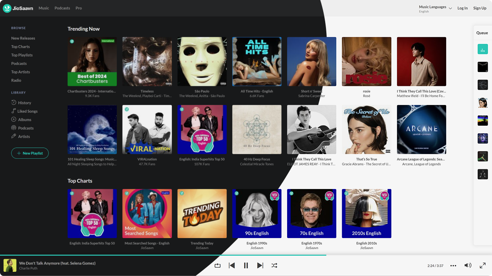

# JioSaavn Downloader

[](#)
[](#)
[][release]

> This extension is still under development and is not yet ready for production use. Many features are still in the works, and there are still some bugs.

A simple and effective extension to download songs, albums, or playlists from [JioSaavn.com](https://jioSaavn.com) with just one click. It also hides ads and promotions from the JioSaavn website and slightly tweaks the UI. Last but not least, it implements a long-awaited **dark mode**.

If you like the extension, give it a star\  
[Follow me][profile] to stay updated on similar projects.

You can download the extension from the following [link][download].  
<small>If you’re having trouble installing it, you can refer to the installation guide below.</small>

<details>
 <summary><b>Table of Contents</b></summary>

- [How It Works](#how-it-works)
- [Features](#features)
- [How to Use](#how-to-use)
  - [Prerequisites](#prerequisites)
  - [Download and Install](#download-and-install)
  - [Customization](#customization)
- [Credits](#credits)

</details>



## How It Works

The extension fetches data from JioSaavn's API endpoints and organizes it in a user-friendly manner. This process occurs entirely within the browser and does not rely on external servers.

Once the data is fetched, it retrieves the URL for the song, album, or playlist in your preferred quality settings. The extension then sends an HTTP request to the server to fetch the M4A file. This step requires CORS to be enabled in your browser. In previous versions, this required an additional extension, but it is now integrated.

For playlists or albums, the extension fetches the individual songs and downloads them one by one, placing them inside a ZIP file for easy download.

## Features

- [x] Dark Mode based on system theme.
- [ ] Download in various qualities: HD **320kbps**, Default **160kbps**.
- [ ] Download **Songs**.
- [ ] Download Top Songs from Artists
- [ ] Download **Albums** and **Playlists** as ZIP files.
- [ ] Download Podcasts
- [x] **Blocks Ads** and Promotions.
- [x] Modifies certain UI elements.

## How to Use

Due to limitations, this extension cannot be hosted on the Chrome Web Store. You can manually install the extension by following the steps below.

You can access _JioSaavn_ directly by **single-clicking** the extension icon, with no need to add extra bookmarks. **Double-click** the extension icon to open the extension options.

### Prerequisites

- [x] Developer Mode: Enable developer mode in your browser.  
       Go to [about://extensions/](about://extensions/) and check the **Developer Mode** checkbox.

### Download and Install

1. Download the extension here: [download][download] and extract the contents.  
   You can also visit the [release page][release] to check for other versions.
2. Go to the Chrome Extensions page: [about://extensions/](about://extensions/).
3. Click the **Load Unpacked Extension...** button.
4. Select the extracted folder and click **Open**.

**Note:** If you downloaded the source code, you can install it by running the following commands in your terminal (ensure that Node.js and npm are installed):

```shell
npm install
npm run build
```

This will build the extension in the build folder. You can then manually install the extension.

### Customization

The extension comes with an options page for customization. To access it, right-click the extension icon and select Extension Options. You can also open the options page by double-clicking the extension icon in the toolbar.

- **Quality Settings**: Choose the quality of songs to download.
  > Default: 160kbps
- **Name Format**: Customize the naming format of the downloaded songs.
  > Default: $title - $album_artist,  
  > Params: $title, $album_artist, $artists, $album, $year, $track, $genre, $bitrate

## Credits

I would like to acknowledge the following individuals and their open-source projects, which were instrumental in the development of this extension:

- [naqushab / saavn-downloader-extension](https://github.com/naqushab/saavn-downloader-extension)  
  Inspired the creation of this extension.
- [Tehhs / chrome-localhost-cors-unblocker](https://github.com/Tehhs/chrome-localhost-cors-unblocker)  
   Enabled the extension to function independently without the need for a proxy server.
- [monuyadav016 / Saavn-Downloader](https://github.com/monuyadav016/Saavn-Downloader)  
  Provided the concept for interacting with the JioSaavn API.

These projects were invaluable in the development process.

[&#x21e1; Back to top](#)

<!-- links -->

[release]: https://github.com/oviirup/jiosaavn-downloader/releases ' '
[download]: https://github.com/oviirup/jiosaavn-downloader/releases/latest 'Download'
[profile]: https://github.com/oviirup
